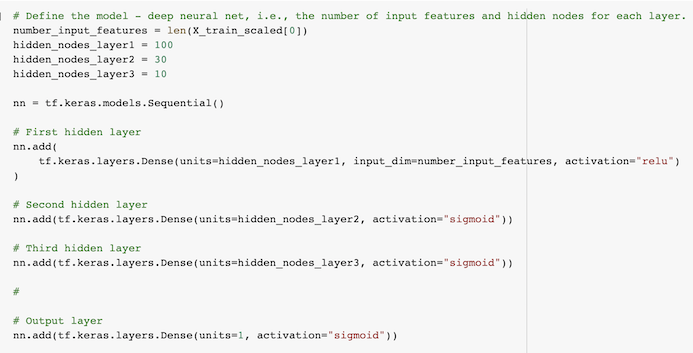
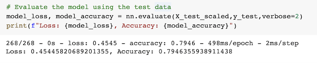

# **Neural_Network_Charity_Analysis**
Neural Networks and Deep Learning Models

## **Analysis Overview**

Using a CSV file containing more than 34,000 organizations that have received funding over the years from an organization called Alphabet Soup, create a binary classifier that is capable of predicting whether applicants will be successful if funded by this organization.

Within this dataset are a number of columns that capture metadata about each organization, such as the following:

- EIN and NAME—Identification columns
- APPLICATION_TYPE—Alphabet Soup application type
- AFFILIATION—Affiliated sector of industry
- CLASSIFICATION—Government organization classification
- USE_CASE—Use case for funding
- ORGANIZATION—Organization type
- STATUS—Active status
- INCOME_AMT—Income classification
- SPECIAL_CONSIDERATIONS—Special consideration for application
- ASK_AMT—Funding amount requested
- IS_SUCCESSFUL—Was the money used effectively

## **Results**

### **Data Preprocessing**

#### What variable(s) are considered the target(s) for your model?

The column "IS_SUCCESSFUL" is the target for the model which is represented by "y", where the goal is to predict if a charity is going to succeed after the donation.

#### What variable(s) are considered to be the features for your model?

The following columns are the features of the model and they are represented by X:

- NAME  
- APPLICATION_TYPE
- AFFILIATION   CLASSIFICATION
- USE_CASE
- ORGANIZATION
- STATUS
- INCOME_AMT
- SPECIAL_CONSIDERATIONS    
- ASK_AMT

#### What variable(s) are neither targets nor features, and should be removed from the input data?

The column "EIN" was removed from the input data because it contains only unique identification values.

### **Compiling, Training, and Evaluating the Model**

#### How many neurons, layers, and activation functions did you select for your neural network model, and why?

- 3 hidden layers

- 100, 30, 10 neurons

- activation functions: Relu for the first hidden layer, and sigmoid for the two other hidden layers and also for the output layer.

#### Were you able to achieve the target model performance?

- Yes, the performance achieved was 80%, which is a considerable improvement from the previous 73%.

#### What steps did you take to try and increase model performance?

- Multiple testes were performed trying different combinations of hidden layers, neurons, and activation functions.
But one of the steps that actually made the difference was to keep the column NAMES, which at first may seem like it contains only unique values since they are identifications. But when investigating it, it actually does not have only unique values which then should be included on the prediction analysis.

## **Summary**

 Summarize the overall results of the deep learning model. Include a recommendation for how a different model could solve this classification problem, and explain your recommendation.

----------------------------------------------------------------------------------------------

Deliverable 4 Instructions
For this part of the Challenge, you’ll write a report on the performance of the deep learning model you created for AlphabetSoup.

The report should contain the following:

Results: Using bulleted lists and images to support your answers, address the following questions.

